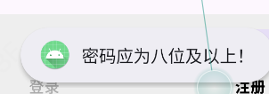
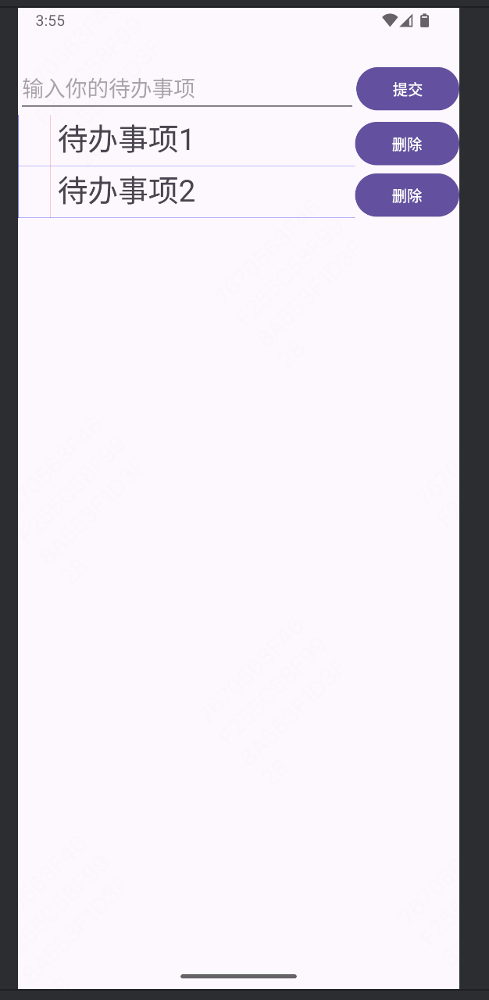

# Android-Studio
    这是一个Android-studio学习过程的记录文档，我会将每天学了什么内容，做了什么功能放在这个文档中。  
## 5.30
.png)
.png)
.png)
.png)
.png)
.png)
## 5.29
.png)
.png)
.png)
.png)
## 5.28
### 1、AlertDialog类
AlertDialog可以提供各种选项，可以为一些最常见的用例构造对话框，包括向用户呈现一条消息，并以按钮的形式提供1～3个选项，提供一个文本输入框供用户进行输入，使用方法为：

先新建一个对象，然后为标题，内容，按钮赋值，最后启动这个AlertDialog。  
### 2、登录注册页面完善
#### 1、添加注册页面
  
里面相关函数的实现逻辑和登录页面类似
#### 2、效果
初始进入页面如下：  

点击下方底边栏的按钮回跳转到对应的fragment，比如点击注册就会显示注册的Fragment：

在这个页面下输入帐号、密码、密码确认如果格式错误就会弹出Toast进行提示，例如：  
  
  
  
如果注册成功就会弹出Alert：  
  
在这个Alert中选择确定就会切换到登录Fragment而且会直接填充帐号和密码：  
  
在这个页面点击登录会跳转到Todo_List页面：  

### 3、SQLite数据库
SQLite是一个关系数据库管理系统，可以使用SQLite数据库来记录数据，比如在上述的登录注册中加入一个SQLite数据库即可存储用户数据，可以通过用户数据来进行登录验证或者注册，使用方法如下：
.png)
.png)
通过重写SQLiteOpenHelper的构造函数、onCreate和onUpgrade方法来分别处理创建新数据库和升级到新版本数据库的过程。  
代码中TABLE_CREATE字符串是用来创建新数据库的SQL语句。在磁盘上不存在数据库的时候，通过onCreate创建一个新数据库。onUpgrade是用来当存在数据库版本不一致时，磁盘上的数据哭版本进行升级到当前版本。使用的方法为删除旧表然后生成新表。addUser和getUser是两个函数，分别用来添加用户和查找用户。  
这样的一个SQLiteOpenHelper的使用方法如下：
首先新建一个对象private DatabaseHelper db;  
db = new DatabaseHelper(getContext());  
然后就可以直接使用这样的一个db了，比如我们可以db.addUser(email,password);来创建用户。
### 4、给登录注册页面加上用户数据库
现在可以检测用户密码输入是否正确了，在注册页面中注册用户会添加到数据库中，然后在登录界面如果登录输入的账号不存在就会显示：

点击确认就可以直接前往注册Fragment，同时在注册界面的账号上会直接填写刚刚登录使用的账号：

在密码不匹配的时候会弹出Toast提示密码错误：

### 5、Content Provider

## 5.27
### 1、Intent
Intent是一种消息传递机制，可以在应用程序内使用，也可以在应用程序间使用。可以用于启动一个特定的Service或Activity、广播某个事件已经发生。
#### (1)、启动Activity
显式启动一个新的Activity类可以使用如下方式：  
Intent intent = new Intent(MyActivity.this, MyOtherActivity.class);  
startActivity(intent);  
如果是在fragment中使用Intent打开另一个Activity，那么需要Intent intent = new Intent(getActivity(),MyOtherActivity.class);  
#### (2)、隐式Intent和运行时迟绑定
隐式的Intent提供了一种机制，可以让匿名的应用程序组件响应动作请求。这意味着可以要求系统启动一个可执行给定动作的 Activity，而不必知道需要启动哪个应用程序或 Activity。  
例如：
Intent intent = new Intent(Intent.ACTION_DIAL, Uri.parse("tel:555-2368"));  
该Activity会提供对这个电话号码进行拨号的动作。  
通过Intent启动第三方程序很方便，但是平时无法保证用户设备上安装了特定的某个应用程序，因此在startActivity之前，可以通过Intent的resolveActivity方法确定能否调用：  
ComponentName cn = intent.resolveActivity(getPackageManager());  
#### (3)、使用Intent广播事件
Intent 可以在进程之间发送结构化的消息。因此，可以通过实现 Broadcast Receiver 来监听和响应应用程序内的这些 Broadcast Intent。  
### 2、使用Intent来获取手机联系人信息
#### (1)、建立MainActivity
首先建立一个MainActivity页面，在这个页面上放一个ListView，对于这个Activity需要实现的内容如下：

在这里创建一个新的Cursor来便利存储在联系人列表中的联系人，并使用SimpleCursorArrayAdapter把它绑定到ListView上。然后为ListView添加一个onItemClickListener，当从列表中选择一个联系人时应该将该项的路径返回给调用Activity。这是一个子Activity。
#### (2)、建立ContactPickerTesterActivity
这个Activity包含了一个用来显示选中的联系人的TextView和一个用来启动子Activity的Button，具体逻辑代码如下：

首先在onCreate中绑定按钮功能，在按下按钮时会使用Intent连接到联系人列表，然后启动这个intent，而且是带有返回值的启动方式。  
然后在onActivityResult函数中做的事情为接受返回信息，如果返回信息正确，就把名字显示在TextView上。
#### (3)、AndroidManifest.xml
在AndroidManifest.xml中设置权限等：

#### (4)、实现效果

初始为此界面然后点击按钮后跳转到如下页面：

在这个页面下可以选择联系人，选完之后会跳回原来的界面，同时在原来的界面上显示联系人姓名
  
### 3、使用BroadcastReceiver来监听电量变化
使用BroadcastReceiver可以监听Broadcast Intent,要使 Broadcast Receiver能够接收广播， 就需要对其进行注册， 要创建一个新的Broadcast Receiver，需要扩展Broadcast Receiver类并重写onReceive事件处理程序。比如：
  
onReceiver函数在广播事件发生时被系统调用，如上图中就是在onReceiver函数被调用时显示当前电量百分比。关于这个类的调用方式如下：
  
先新建一个BatteryReceiver对象，新建一个IntentFilter对象，并指定Intent.ACTION_BATTERY_CHANGED作为过滤的动作类型，ACTION_BATTERY_CHANGED 是一个 Sticky Broadcast，它意味着即使在注册后，也可以立即收到当前电池状态。然后注册这个batteryReceiver。  
在每次电量发生变化时，都会在屏幕中弹出一个Toast：

## 5.26  
### 1、fragment
fragment可以将Activity拆分成多个完全独立封装的可重用组件，每个组件都有自己的生命周期和UI布局，每个fragment都是独立的模块，并与它所绑定的Activity紧密联系在一起。在初始创建fragment的时候，会有如下代码：  

ARG_PARAM1和ARG_PARAM2两个变量用于定义传递给片段的参数的键名，通常用于从Bundle中检索某个特定的值。成员变量mParam1和mParam2用于存储传递给片段的参数的实际值。BlankFragment是片段的空构造函数，所有Fragment类都需要一个空的公共构造函数，因为系统会在需要的时候实例化片段对象。  
newInstance是一个静态工厂方法，用于创建BlankFragment的实例，它接受两个参数param1和param2，将它们存储在一个Bundle中，并将此Bundle与片段关联。  
### 2、fragment生命周期  
fragment的生命周期基本上和Activity类似，其余多出来的事件，则是特定于Fragment和Fragment添加到它的父Activity的方式的事件。具体调用方式和调用时机如下图所示：  

### 3、fragment manager
每个Activity都包含一个Fragment Manager来管理它所包含的Fragment，通过执行Fragment Transaction来添加、删除和替换Fragment。

可以看到通过以上的方式就可以把一个Fragment放到Activity中，当然也可以删除或者替换一个Fragment，比如：fragmentTransaction.remove(getSupportFragmentManager().findFragmentById(R.id.fragment_container));可以删除一个Fragment；fragmentTransaction.replace(R.id.fragment_container,new BlankFragment2());可以替换一个fragment。  
### 4、改变To-do List列表的外观
给前两天做的To-do List中的每一条增加类似于便签条的外观，首先在colors.xml中多设置几种颜色：

然后定义一个新的ToDoListItemView.java文件，代码如下所示：

这段代码对AppCompatTextView进行了扩展，首先成员变量：marginPaint 和 linePaint: 分别定义用于绘制边距线和行线的 Paint 对象。paperColor: 保存纸张背景颜色。margin: 存储自定义边距尺寸的浮点值。然后就是三种构造函数，在这三种构造函数中都调用了init函数来进行视图的初始化。init函数获取资源对象并初始化Paint对象。然后重写了onDraw函数来进行自定义绘制，总共绘制了三条线，然后使用 canvas.translate(margin, 0) 来偏移绘制位置，确保文本不会贴在左边界，使文本以边距起始位置为准开始绘制。  
最后效果图如下：

### 5、登录注册页面
这部分做了一个可以登录注册的Activity，登录和注册为两个Fragment，在整个Activity下方设计了一个底边栏，底边栏有两个按钮可以跳转到不同的Fragment。
#### (1)、底边栏
在res/menu文件夹下新建一个bottom_nav_menu.xml用于设计底边栏，代码如下：

这里放了两个按钮，每个按钮都有一个图片，图片在https://fonts.google.com/icons 上下载下来，然后保存到res/drawable下。  
然后就可以直接使用这个底边栏了，实际上，这个只算是一个条目栏，无论放在Activity顶部还是底部都是可以的，放在底部就是底边栏了：

通过这样的方法即可使用，其中constraintVertival_bias为1时就是底边栏，为0时就是顶边栏。在这里面还设计了一个nav_item_color就是可以在被点击的时候显示黑色，未点击时为灰色：

在login.java中实现这个底边栏的功能：

通过替换Fragment来实现页面的切换。
#### (2)、fragment_login
登录的fragment，具体的布局怎么实现的可以直接看代码，布局如下：

这里讲一些个人认为比较重要的部分：
首先最外面的布局是一个固定大小的，大小和log中的fragment一样，里面还有一个constraintlayout包裹住账号和密码输入，这个layout的大小不是固定的，是wrap_content，之所以会有间距是通过padding实现的。然后对于每个布局包括输入框都有一个圆角边框，是通过写了一个border.xml然后让背景为border来实现的，border.xml代码如下：

然后在login.java中实现了登录按钮的功能，会按照正则表达式来看看格式是否正确，如果账号形式不是邮箱地址，那么就会弹出一个提示说账号格式不正确，如果密码不足八位就会提示密码格式不正确，具体代码如下：

### 6、Toast
Toast是一种短暂出现的通知，它们只会出现几秒就消失，Toast不会获取焦点，不会打断当前活动的应用程序，可以通过Toast toast = Toast.makeText(context，信息，持续时间)；来实现。通常情况下，使用标准的Toast就足够了，但是也可以自定义它的外观和其在屏幕上出现的位置，通过toast.setGravity(位置，x偏移量，y偏移量)；来更改出现的位置。一般来说使用时格式如下：
.png)
这里使用getContext()是因为这段代码在Fragment里面，他要请求宿主Activity的Context，如果是Activity使用Toast，可以直接用Context，第二个参数是显示的内容，第三个参数是显示持续时间，Toast.LENGTH_SHORT代表持续时间短，Toast.LENGTH_LONG代表持续时间长。一般显示效果如下：

## 5.23  
### 1、Activity与UI   
 Activity是很重要的一个组件，每一个Activity都表示一个页面，大部分的Activity都被设计为占据整个屏幕。在使用Android Studio每当创建一个新的Activity的时候，会自动生成如下的一段框架代码以及一个xml文件：
.png)
在上述代码中setContentView方法用来把一个UI分配给一个Activity，这个函数中的R.layout.activity_main指的就是layout文件夹下自动生成的activity_main.xml文件。一般情况下都使用这种方式来把xml中的布局关联到Activity上。这个xml文件中基础代码及布局如下：
.png)
上图中的constraintlayout是一个布局模式，使用约束关系来创建复杂的页面，例如图中的TextView通过约束到父布局的顶部、底部、左右来使得这个TextView显示在布局的正中间。当然还有其他的布局模式，比如说：FrameLayout,LinearLayout,RelativerLayout,GridLayout。下面详细介绍这几种布局分别是什么样子的：
#### （1）FrameLayout
FrameLayout是一种最简单的布局管理器，它只是简单的把每一个子视图放置在边框内，默认放置在布局的左上角，不过可以用gravity来改变其位置。在添加子视图的时候，它会把新的子视图堆积在前一个子视图的上面，每一个新的子视图可能会遮挡住上一个。具体代码及布局如下图所示：

可以看到在这个布局中放了一个内容为“TextView”的TextView子视图，这个时候如果我们再添加一个新的子视图会被堆积在原本的这个TextView上。
#### （2）LinearLayout
LinearLayout有两种，一种是按照垂直方向来对其每一个子视图，另一种按照水平方向来对其每一个子视图，可以使用weight来控制每一个子视图在空间内的相对大小，比如水平方向的如图所示：

可以看到在LinearLayout布局中水平放置了一个TextView和一个Button，这两个子视图按照1:2的水平比例占据整个布局，可以在每个子视图的weight中修改。垂直布局与此类似，只需要将android:orientation="horizontal"中的horizontal改成vertical就可以了。
#### （3）RelativeLayout
relativeLayout使用相对位置来进行布局，可以定义每一个子视图之间或子视图与屏幕边界之间的相对位置，与constraintlayout布局的使用方法类似。如下图我们采用了相对布局定义了TextView和Button之间以及它们和边界间的距离：

#### （4）GridLayout
这是一种网格化布局形式，会在一系列的行与列中进行布局，比如下图所示：

可以看到每个子视图中都有"layout_row"和"layout_column"属性，代表着它处在第几行第几列。  
上述的这些布局都可以扩展，以适应各种设备的尺寸，由于它们不使用绝对位置，所以在设计上可以很好的运行在各种Android设备上。在以上所有的图片中，我们可以看到对于"layout_width"和"layout_height"既有直接赋值，比如说：android：layout_width="3dp"就代表着宽度为3dp。这是一种绝对赋值的方式，还有的使用了"match_parent"和"wrap_content"两种相对的方式，match_parent表示和父布局的对应值保持一致，wrap_content表示正好包裹住内部元素。
### 2、Activity的生存期
Activity具有活动状态、暂停状态、停止状态和非活动状态。  
<b>活动状态</b>：当一个Activity位于栈顶，可见且具有焦点即为活动状态，可以接受用户的输入。Android会不惜一切代价来保持这个Activity处于活动状态。  
<b>暂停状态</b>：当一个Activity是可见的，但是不具有焦点的时候就是暂停状态，比如说有一个非全屏或者透明的Activity位于另一个Activity之前时，下面的这个Activity就会处于暂停状态。这个状态仍然被当作近似于活动状态但是它不会接受输入。  
<b>停止状态</b>：当一个Activity完全不可见的时候就处于停止状态，此时这个Activity仍存在于内存中，但是当其他地方要用到内存的时候，他就会成为首选的被终止对象。尽管Activity处于停止状态是不可见的，但是它的数据及UI还是会被保存着，我的理解是当一个Activity不可见时，证明有另一个全屏的Activity处于它前面，此时如果我想返回上一个页面，那么保存着之前不可见Activity的数据及UI就可以直接使用，可以节省时间。  
<b>非活动状态</b>：Activity被终止后，在下次启动它之前就处于非活动状态，此时这个Activity已经从Activity栈中移除了，在它可以被再次显示和使用之前要重新启动。  
了解了Activity的状态之后就可以更好地理解Activity的生命周期，首先Activity有完整生存期、可见生存期和活动生存期。<b>完整生存期</b>即为Activity被创建后一直到非活动状态的这段时期，对应的开始与结束函数为onCreate和onDestroy；<b>可见生存期</b>为Activity从可见的到不可见的这段时期，对应两个函数为onStart和onStop；<b>活动生存期</b>为Activity具有焦点的这段时间，对应的两个函数为onResume和onPause。如下图为各种函数的使用：  

### 3、RecyclerView
RecyclerView是Android Studio中的一个列表控件，要进行使用需要一个Adapter，Adapter用于绑定数据到RecyclerView的每一个ViewHolder上，当然Adapter不仅仅用于RecyclerView，它适用于所有扩展了AdapterView类的视图组。对于recyclerView的Adapter比如下面这个todoAdapter：

Adapter也需要一个xml文件用于定义每个Adapter的布局，比如图中的todo_view.xml就是，RecyclerView会使用这个xml来创建每一个ViewHolder中的对象。对于这个Adapter，我实现了获取todoList中的数据并显示，还实现了一个删除按钮用于删除todoList中对应的数据。
### 4、Todo-List小应用
使用了RecylclerView实现了一个待办事务列表，具体的功能如下：
#### （1）点击提交按钮时获取editView中的文本然后加到recylerView中，如下两图所示：

#### （2）点击删除按钮时删除该ViewHolder对象对应的内容，如下图所示：

